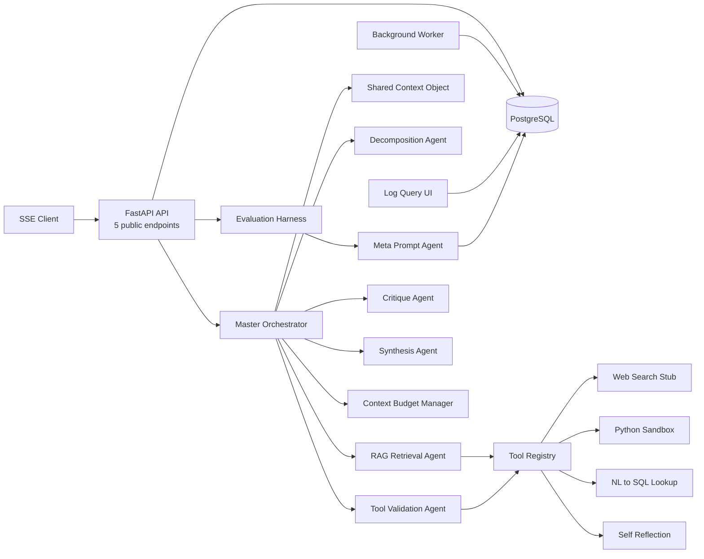

# Architecture Diagram

```mermaid
flowchart LR
  Client["SSE Client"] --> API["FastAPI API\n5 public endpoints"]
  API --> DB[("PostgreSQL")]
  API --> Orch["Master Orchestrator"]
  Worker["Background Worker"] --> DB
  Logs["Log Query UI"] --> DB

  Orch --> Ctx["Shared Context Object"]
  Orch --> Decomp["Decomposition Agent"]
  Orch --> Retrieval["RAG Retrieval Agent"]
  Orch --> Validation["Tool Validation Agent"]
  Orch --> Critique["Critique Agent"]
  Orch --> Synthesis["Synthesis Agent"]
  Orch --> Budget["Context Budget Manager"]

  Retrieval --> Tools["Tool Registry"]
  Validation --> Tools
  Tools --> Search["Web Search Stub"]
  Tools --> Py["Python Sandbox"]
  Tools --> SQL["NL to SQL Lookup"]
  Tools --> Reflect["Self Reflection"]

  API --> Eval["Evaluation Harness"]
  Eval --> Meta["Meta Prompt Agent"]
  Meta --> DB
```
